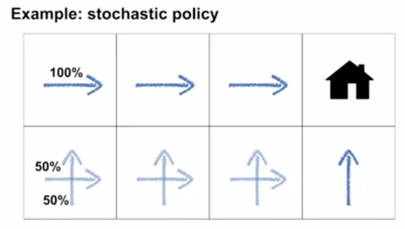
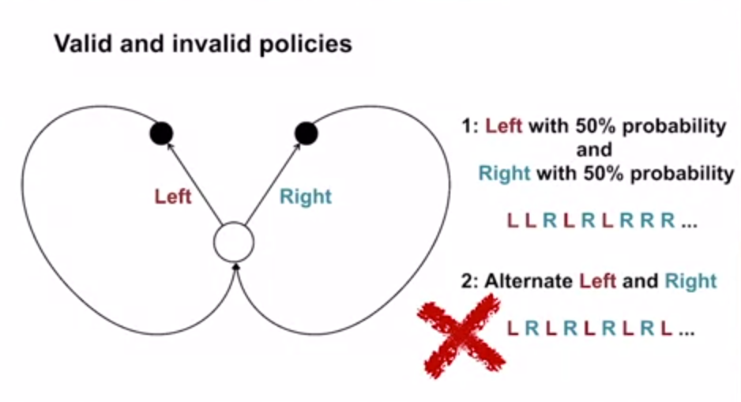
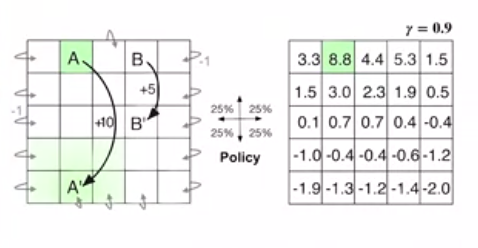

# Policy and Value Function

Policy: 

* It is how an agent selects actions.

* It is a distribution over actions for each state

# Stochastic and Determinstic Policies

## Determinsitc Policy

$s$: state
$a$: action

$\pi(s) = a$

$\pi: \{s_0 \rightarrow a_1, s_1 \rightarrow a_0, s_2 \rightarrow a_0\}$ is a deterministic policy. 

Different states may choose the same action so some action may not be selected for any state. 

## Stochastic Policy

$\pi(s) \rightarrow \pi(a\mid s)$

$$\sum_{a \in \mathcal{A}(s)}\pi(a\mid s) = 1 \\ \pi(a\mid s) \geq 0$$

||$$s_1$$|$$s_2$$|$$s_3$$|
|---|---|---|---|
|$$\pi(a_1\mid s)$$|0.2|0.3|0.4|
|$$\pi(a_2\mid s)$$|0.8|0.7|0.6|

### Example

Case: A robot wants to go back home.

The policy is given below:

## Validity

The policy should only depend on the current state not other things like

* Time

* Previous State

* Action

### Action based on Action

An example is given below, In case 2, the action is chosen based on the previous action
$$\{a_{n-1}=L\rightarrow a_{n} = R\}, \{a_{n-1}=R\rightarrow a_{n} = L\}$$

**NOTE**: However, if certain action sequetial patterns are important factor to acheive higher rewards, the previous actions should be included in the state. 

# Value Function

Recall: The RL policy is to acheive the most reward in a long run. 

Value functions formalise the mapping from the policy to the reward. 

## State-Value Function

**Def**: state value function $v_{\pi}(s)$ is the future reward that an agent will receive starting from a particular (given) state $s$, then following the policy $\pi$.

$$v_{\pi}(s) = \mathbb{E}[G_t\mid {S_t = s}]; G_t = \sum_{k = 0}^{\infty}{}\gamma^kR_{t+k+1}$$

**NOTE**: Value function $v_{\pi}(s)$ is always defined based on a policy $\pi$. 

## Action-Value Function

**Def**: action value function $q_{\pi}(s, a)$ is the future reward that an agent will received after selecting a particular action $a$ from a particular state $s$, then following the policy $\pi$.

$$q_{\pi}(s, a) = \mathbb{E}[G_t\mid {S_t = s, A_t = a}]$$

## Remark
Value function is crucial in RL since it allows the agent to know the quality of the current situation (state or state-action pair) instead of waiting to the longer measurement. 

Value function allows an agent to judge the quality of a policy. 

## Example: Derive the Value function from an MDP

Policy $\pi$: A uniform random policy. 

Reward: If the agent bumps out theside grid the reward is -1; if the agent arrives at A the reward is +10 and if it arrives at B the reward is +5.

The result of the value function $v(s)$ is given in the right half. We can see at the boundary grids, the scores are negative because based on the random policy, the agent is likely to fall. 

For the grid A, the state-value is +8.8 smaller than +10 because it will cause the agent moving to A' and causes the agent bump outside in the future. By contrast, for the grid B, the state-value is higher than the reward (+5.3). This is because B will transfer the agent to B' which is a safe place and nearby B. 

