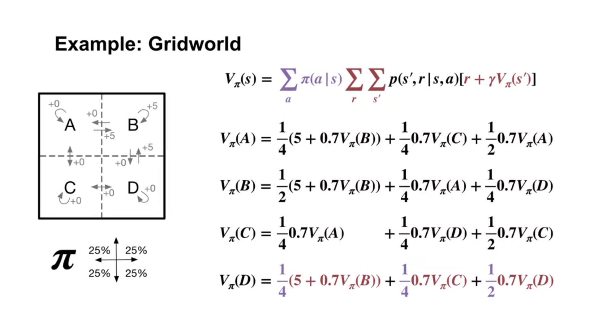

# Bellman Equation

Bellman equation builds the connections between current and future values. 

## Bellman for State-Value Function

The definition of state-value function is 
$$v_{\pi}(s) = \mathbb{E}[G_t\mid {S_t = s}]; G_t = \sum_{k = 0}^{\infty}{}\gamma^kR_{t+k+1}$$

The state-value function can be expanded into a recursive expression:
$$v_{\pi}(s) = \mathbb{E}[R_{t+1}+\gamma G_{t+1}\mid {S_t = s}]
\\ = \sum_a\pi(a \mid s)\sum_{s'}\sum_{r}p({s',r} \mid {s, a})[r+\gamma\mathbb{E}_\pi[G_{t+1}\mid S_{t+1}=s']]
$$

* $R_{t+1}$ denotes the immediate reward cause by the current state (*or the next one*) at time $t+1$.
* $\pi(a \mid s)$ denotes probability distribution of actions given the current state $s$.

* $p({s',r} \mid {s, a})$ denotes given state $s$ excuting $a$ the probability of reaching the next state $s'$ and gaining reward $r$.
* $\sum_{s'}\sum_{r}p(\cdot)$ denotes the expectation of all possible state transfers and rewards. In other words, the sum of the outcomes weighted by the probability that they occur. 
* $\mathbb{E}_\pi[G_{t+1}\mid S_{t+1}=s']$ denotes the expected cumsum reward $v_{\pi}(s')$ from the next state $S_{t+1} = s'$.

By tidying the equation, we can get the bellman equation:

$$v_{\pi}(s) = \sum_a\pi(a \mid s)\sum_{s'}\sum_{r}p({s',r} \mid {s, a})[r+\gamma v_{\pi}(s')]$$

## Bellman for Action-Value Function

Following the same principle, the bellman equation for the action-value function is given below,

$$q_\pi(s, a) = \sum_{s'}\sum_{r}p({s',r} \mid {s, a})[r+\gamma \sum_{a'}\pi(a'\mid s')q_{\pi}(s', a')]$$

* $\sum_{a'}\pi(a'\mid s')q_{\pi}(s', a')$ denotes the expectation of the action-value per each action $a'$ given the next state $s'$

## Remark

The current time-step's state\action values can be written recursively in terms of future state\action values.  

# Why Bellman Equation

The figure below demonstrates a 2x2 grid game. The agent can move up, down, left or right. Let us assume the policy $\pi$ is the random policy with moving towards each direction of the probability = 25%. 
Using the Bellman equation for the state-value function, we can have a four equations shown below.  

By simply put the 4 equations to the solver we can work out the state value for each state. 

## Remark

The Bellman equation converts the original unmanageable infinite sum (recursive state-value functions) over possible futures to a simple linear algebra problem (a set of linera equations). 

In this case, we use the Bellman equation to directly write down a set of equations for state values, then solving it. This approach maybe possible for the MDP of moderate size. However, it is not practical for real-world complex problems. 

For example, for a chess game, to list all state transfers, you will end up with $10^{45}$ linear equations. It is still infeasible for the modern computer to solve it. 

