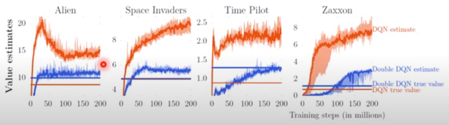
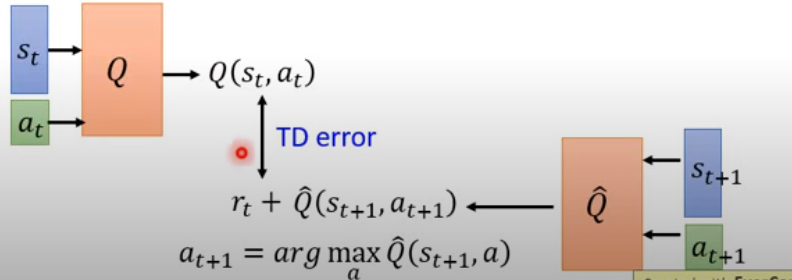
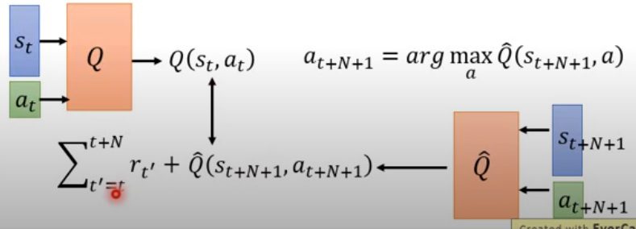
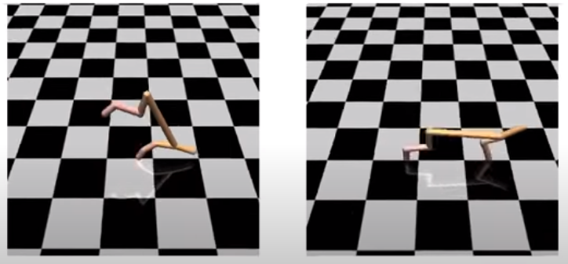
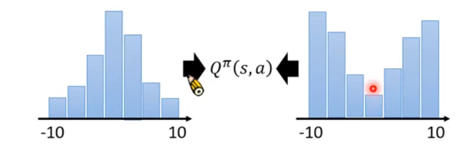
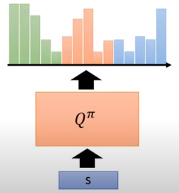

# Double Q Learning
## Problem to be solved
The Q value in DQN is usually over-estimated. 

The graph above shows the real Q value (straight lines) and the estimation (noisy curves); red = DQN; blue = Double DQN.

Clearly, we can see that the Q estimation of DQN is higher than the real value. 

In DQN, because the policy is getting stonger, the Q value will increase accordingly. 

The estimated Q value of DQN is higher than Double DQN however it is a bludd, we can see that the real accumulated reward (blue straight) of Double DQN (red straight) is significantly higher than DQN in sub-figure 1, 3, 4. 

## Reason:
Target value is overly set (higher than the desire value). 

Equation: $Q(s_t, a_t) \longrightarrow r_t + \underset{a}{max}Q(s_t, a_t)$

Because te critic always selects the best action $a$ which must be higher than the current value. Because the corresponding Q estimation can be inaccurate, only the highest is selected, so the critic "iteratively" raises the Q estimation. 

## How to solve?
Two Q functions one for selecting the action, another one for calculating the Q function. 
Equation: $Q(s_t, a_t) \longrightarrow r_t + Q'(s_{t+1},\underset{a}{max}Q(s_t, a_t))$

$Q$ is for selecting the function, i.e. calculate Q value for all actions and see which one is the highest.  
$Q'$ is for calculating the function.

The double structure prevents over-estimation, an intuitive explaination:

* If $Q$ over-estimates $Q(a;s)$ so $a$ is selected however $Q'$ does not over-estimate the $Q'(a; s)$, the output will still be a "proper" value. 
* If $Q'$ over-estimates a certain $a$ but if $Q$ does not select this $a$, the output will also be a proper value. 
* The worst case is that both $Q$ and $Q'$ overly estimates a however the chance of over-estimation is reduced. 

提案和过审的感觉。

## Implementation:

There are two models in this case, $Q$ and $Q'$. In the practical implementation, there are already two NNs in DQN the policy net and the target net. Double DQN uses the policy net as $Q$ and the target net as $Q'$.

# Dueling DQN
## Problem to be solved

Dueling DQN does not directly output Q value but decompose the Q value to two parts. The NN has two output paths, one to a scalar $V(s)$ and another to a vector $A(s, a)$:

1. $nn_V: s \rightarrow V(s)$ 
2. $nn_A: s \rightarrow A(s, a)$ 

$A(s, a)$: for each action, it has a value. 

$Q(s, a) = A(s, a) + V(s)$

# Advantage

$V(s) = 
\begin{bmatrix} 2 & 0 & 4 & 1\end{bmatrix}$

$A(s, a) =
\begin{bmatrix} 1 & 3 & -1 & 0 \\ -1 & -1 & 2 & 0 \\0 & -2 & -1 & 0\end{bmatrix}$

$Q(s, a) = V(s) + A(s, a) = 
\begin{bmatrix} 3 & 3 & 3 & 1 \\ 1 & -1 & 6 & 1 \\2 & -2 & 3 & 1\end{bmatrix}$

In Dueling DQN, the network does not optimise Q values instead it change V values and A values. Specifically, it prefers changing V value rather than A value. This is realised by setting an constraint to A vectors. 

Example: 

$Q(a; s) = \begin{bmatrix}3 & -1 & -2\end{bmatrix} \rightarrow 
\begin{bmatrix}4 & 0 & ?\end{bmatrix}$
The question mark (?) means there is no sample for this action. 
In this case, if the critic decides to change $V$ value (but not $A$ vector), it will update the ? (3rd action) value as well.  

It is more effective way to use data and deal with missing samples. 

## Concern:

If the update rule is not well designed, the Dueling DQN will degenerate to the original DQN, i.e. $V(s)$ always equals 0.

To tackle this issue, the solution is to set up constraints for $A$ vectors, e.g. the sum of each column is 0, $\sum{A(a; s) = 0}$.

Example: 
$Q(a; s) = \begin{bmatrix}3 & -1 & -2\end{bmatrix} \rightarrow 
\begin{bmatrix}4 & 0 & -1\end{bmatrix}$
Due to the constraint, it is impossible to increase each element in $A(a|s)$ by 1 so the solution will be increase $V(a|s)$ by 1. 

## Practical Implement
We know during the interactions, the change of $A$ is $A(a| s) = \begin{bmatrix}7 & 3 & 2\end{bmatrix} \rightarrow 
\begin{bmatrix}3 & -1 & -2\end{bmatrix}$

* Normalise $A(a|s)$ to 0: $\begin{bmatrix}7 & 3 & 2\end{bmatrix} \rightarrow \begin{bmatrix}3 & 1 & -2\end{bmatrix}$

* Add to $V(s) = 1$: $\begin{bmatrix}3 & 1 & -2\end{bmatrix} + 1 = \begin{bmatrix}4 & 2 & -1\end{bmatrix}$. Here $V(s) = 1$ is an example output from the current network. 

* The normalisation step is a part of the neural network. It does not contain any parameter but jointly partipates the training procedure. 

# Prioritized Reply

## Problem to be solved
The historical data (in the replay buffer) with larger TD errors should receive more attentions.  

TD error is the error between the expected Q value and the output Q value from policy network. 
## Intuition
Because the samples with higher TD errors mean to the shortcoming of the network so they should be fed into the network for training with a higher priority. 

## Other
In fact, because it uses a different way to select samples, the method to update parameters of DQN in Prioritized Reply is different.  

# Multi-step
## Problem to be solved
MC introduces a higher variance due to the long-term estimation, i.e. till the end of each episode. By contrast, TD introduces errors in estimtion during training (i.e. the true $Q$ value is unknown when training). 

## Solution

Instead of using one step TD, using samples of multiple steps to train the neural network. It means a more accurate estimation of Q and a reduced variance (i.e. less steps than running throuhg the full episode). 

$(s_t, a_t, r_t, s_{t+1}) \rightarrow (s_t\dots s_{t+m - 1}, a_t\dots a_{t+m - 1}, r_t\dots r_{t+m - 1}, s_{t+1}\dots s_{t+m})$

It follows the concept of Model Predictive Control to predict and adjust multi-step target reward. 

## Implementation:

# Noisy Net

## Motivation

Improve RL performance via a better (systematic) exploration method.

## Review

Epsilon Greedy allows the actor to randomly select an action with probability $\epsilon$.

## How?

Noise net adds noise on parameters (of Q function) only at the begin of each **"episode"** (i.e. not every step)

When the actor is interacting with the environment, find a better $\pi'$ to replace the current $\pi$:

$$Q(s, a) \rightarrow \tilde{Q}(s, a) \\ a = arg \underset{a}{\text{max}}\tilde{Q}(s, a)$$

OpenAI: Add Gaussian noise to each parameter of the DNN. 
DeepMind: Noise is determined by a sequence of parameters means the NN can control how to add noise. 

Within one episode, the paramenters of NN are always fixed. 

## Difference:
### Random Trial
Noise on action means given the same state, the agent may take different actions. This is less like the true execution of a policy in a real world. I.e. you do not want to mess up stuff if you are on the right track. 

### Systematic Trial
Noise on Q means a consistent action (state-dependent exploration)for a states in the same episode, the agent will have different action preference in different episode to evaluate if the purturbed policy is a better choice.

An example of trainning results are shown below, the left figure is the noise on the action and the right is the noise on the Q network. 

# Distributional Q function

Q function is the **expectation** vale of accumulated rewards (reward itself is a distribution, as shown below). The expectation can be viewed as mean value. 

## Motivation

The mean value cannot fully represent a distribution. An example is given below.  

The left is a bell shape distribution of the Q value given a state s, i.e. $Q(s)$. The mean value is 0. The right is a another $Q(s)$ distribution with the mean value equals 0. Obviously they are different. So if the distribution is like the right figure, it means the Q value is unstable given state $s$. For example, it means the state is not a good state for certain applications that requires stability. 

It can mitigate emprical risks. E.g. if an action has a slightly higher mean value but much more variance, the actor may be avoid taking this action. 

## How

In this approach, instead of output a Q value for each state, it outputs the histogram of the Q value for a given state $s$ as shown below. The histogram contains more information than the pure mean value. 

In this figure, each color denotes the histogram of Q when executing an action $a$ at state $s$; each bar denotes when taking this action, the probability of gaining this reward. During testing (interacting with the environment), the strategy is to select the action with the highest mean value. 

\\
\\
\\

Core: Change the network architecture. 

 