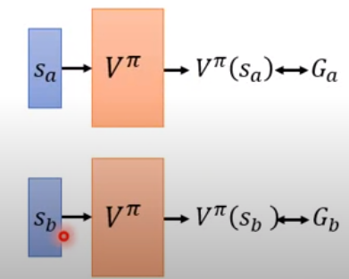
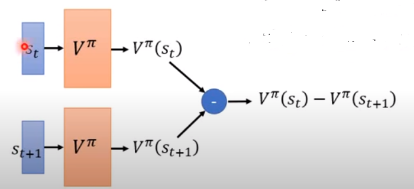
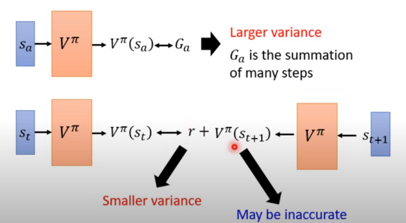
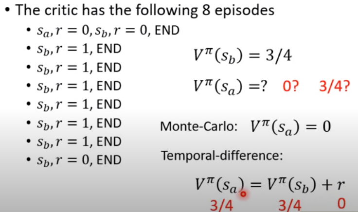
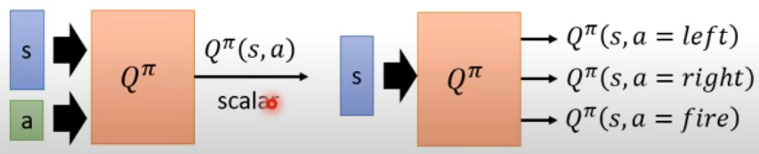
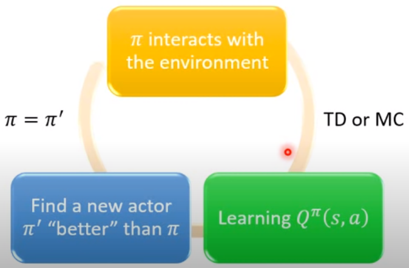
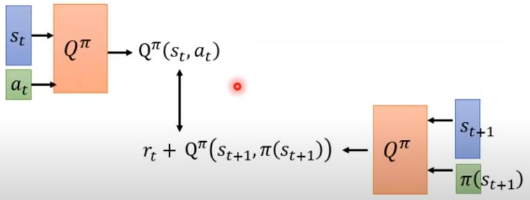

Hungyi-Lee-L3-DQN-Lecture.md
# Design Principle
Q-Learning is an approach belong to **Value Method**. The value method tries to learn **Critic** instead of **Action** (action is what policy method want to learn, means according to the policy, what is the next action).

Critic evauates how good the state $s$ is given an actor $\pi$.

An critic is called the state-value function $V(s)$: **FROM** a given state $s_t$, an actor $\pi$ interacts with the environment till the game over, what is the expected accumulated reward. 
$V: s_t \rightarrow E(r_t+\dots+r_{end})$

NOTE: There are two main issues in estimating function $V$:

* $V$ needs to be generalisable to different states, even if the state has not been observed. 

* It is very difficult to get the true expectation $E(r_t+\dots+r_{end})$. 

The critic is bound to an actor to evaluate the value of a state. E.g. at the same state, a strong actor may have a higher change to win the game (a larg e reward) but a weak actor may easily lose the game (a low reward).

# How ever estimate $V^{\pi}(s)$

## Monte-Carlo (MC) based approach
Let an actor play the game and the critic evaluate the rewards gained by actor and state-action transitions. 

Given an actor $\pi$, a state $s_a$, the critic "samples" the cumulated rewards $G_a$ until the game over. 

Here "sample" means letting the actor $\pi$ play the game multiple times and see the different reward results.  

In DRL, the V function is actually a neural network. Even if the critic inputs a state that the network neven saw, the network can still generalise a $G$ value for that state. 

So, the V function can be learned via regression neural network.

The training object is when the input is $s_a$, the output should be as close as possible to $G_a$. 

## Temperal-difference (TD) based approach

Why? because the MC method requires an actor to play the game until the game over. The training requires the critic to gather the full sequence of samples in an episode. $$(s_1, a_1, r_1, s_2), \dots, (s_{T-1}, a_{T-1}, r_{T-1}, s_{T})$$
Here, $T$ means game over. 

Differently, TD only needs the current sample for training $$(s_{t}, a_{t}, r_{t}, s_{t+1})$$
Here $t$ denotes the current time. 

Why TD: However, in certain cases, the episode can be very long or inifinitely long (e.g. RPG game and stock price). It is impractical to run episodes a number of times. In this case, the MC method may not be feasible. 

The TD method is based on the formula below:
$$V^{\pi}(s_t) = V^{\pi}(s_{t+1}) + r_t$$
This formula means the cumulated reward at state $s_t$ is based on the cumulated reward of the previous state $s_{t+1}$ while the transition (action) brings in an immediate reward $r_t$.

**NOTE**: The immediate reward is affected by state-to-state transit (thus to receive a reward) it is fixed and given in a usual case.  

### An obvious way to train the network

Let us have one network $V^{\pi}$, then input $s_t$ and $s_{t+1}$, the network will generate the cumulative reward $V^{\pi}(s_t)$ and $V^{\pi}(s_{t+1})$. 

By substracting the previous V estimation from the current one, the desired output should be the immediate reward $r_t$. 
In general, it can be viewed as a process to fit $r_t$.

## Difference between MC and TD

MC: Large variance (multiple steps uncertainty; to learn the expected cumulated reward). Because the environment is not deterministic, from a state $s_t$ given and actor, the result is deterministic. 

The randomness will apply at each step in an episode. For instance, let us say the randomness causes variance of $\sigma^2$ in each step. Starting from state $s_t$, at the end of the episode $s_{t+k}$ the variance is enlarged by $k$, i.e. the variance is $k^2\sigma^2$.

TD: Lower variance (a single step uncertainty; to learn a single step reward). As mentioned above, the TD is to fit immediate reward $r$ (r is also a random variable). Because there is no need to accumuate the immediate reward, the randomness of reward $r$ will not be scaled up. 

TD: Low accuracy. Because the cumulated value $V^{\pi}(s_t)$ and $V^{\pi}(s_{t+1})$ can be quite inaccurate, the learning process may be unstable. 

### Example

The two different methods cause two different estimation of reward. 

# A Practical Critic -Q Function- 

Previously, the critic is a state value function $V^{\pi}(s)$, means to evaluate the cumulative reward from a given state $s$. Q value function is an extension of V value function, which considers the impact of action. 

$Q^{\pi}(s,a)$ means when using actor $\pi$, the cumulated reward expects to be obtained after taking $a$ at state $s$.

NOTE: It assumes the at state $s$, an actor $\pi$ **deterministically acts $a$** then **leys the actor $\pi$ to select the following actions**, then calculate the cumulated reward. In fact, the actor at state $s$ may not prefer to act $a$, but Q learning forces the actor to execute action $a$.

## Different Neural Networks for Q Learning

There are two types of NN topo for Q learning, as shown below. 

* The first one considers $a$ as an input with state $s$ to calculate the Q value. It can support continuous action space.  
* The second one considers only with state $s$ as the input to calculate the Q value. It has multiple outputs in which each one corresponds to an action. 
NOTE: the second topology does not support continuous action space. 

## Use Critic to Solve the Actor Problem

There are 3 steps to implement a Q-learning to solve real world problem:

* Let the actor $\pi$ interact with the environment to get samples $(s_n, a_n, r_n, s_{t+1}) ... (s_{n+k}, a_{n+k}, r_{n+k}, s_{t+k+1})$
* Learning the Critic $Q^{\pi}$ for state-actions pairs using TD or MC
* Find a better actor $\pi'$ (according to the Critic) to replace the original actor $\pi$, go to step 1

The cyclic training graph is given below. 

NOTE: (to alighn with implementations) the truth is that $\pi$ never exists (even after training Q) because value-based method never **explicitly** creates an actor. Instead, the actions are generated by the critic (i.e. implicitly formulates $\pi$).

So, in the words of value-based (for implementation), the steps of Q learning are:

* Let a critic $Q^{\pi}$ to generate a sequence of actions (and state transitions) corresponding to the best Q value at each step. The action selection is based on $\pi'(s)=arg\underset{a}{\text{~max}}Q^{\pi}(s, a)$
* Feed the state-action-reward samples into NN to learn a better critic $Q^{\pi'}$, it can be TD or MC.
* Replace the original critic $Q^{\pi}$ by the new one $Q^{\pi'}$, go to step 1.

The interesting property of Q learning is "if the critic can learn the Q values for state-action pairs, it can always find a new actor $\pi'$ better than $\pi$".

## Train Critic using the TD method

The training of a Q network can realised via the TD method. The difficulty of trainning is the Q estimations are inaccurate. (This seems to be slightly different from the simple tabular-based method)

The TD method means the Q value of the current state-action pair $(s_t, a_t)$ should equals the sum of the immediate reward $r_t$ and the Q value of the next state-action pair $(s_{t+1}, a_{t+1})$. 

In the course, the lecturer claims that theoretically both two networks above should be tuned according to the errors. So it is unstable. My question is that the network should be tuned to minimise the distance between $Q^{\pi}(s_{t}, a_{t}) - Q^{\pi}(s_{t+1}, \pi(s_{t}))$ and $r_t$.

To avoid tuning the two models simultaneously, the practical ways to do this is to fixed one network (the one takes $\pi(s_{t+1})$ as input) and only the the other one (takes $a_t$ as action input). The fixed network is called the target network. The target network is updated every N steps. 

